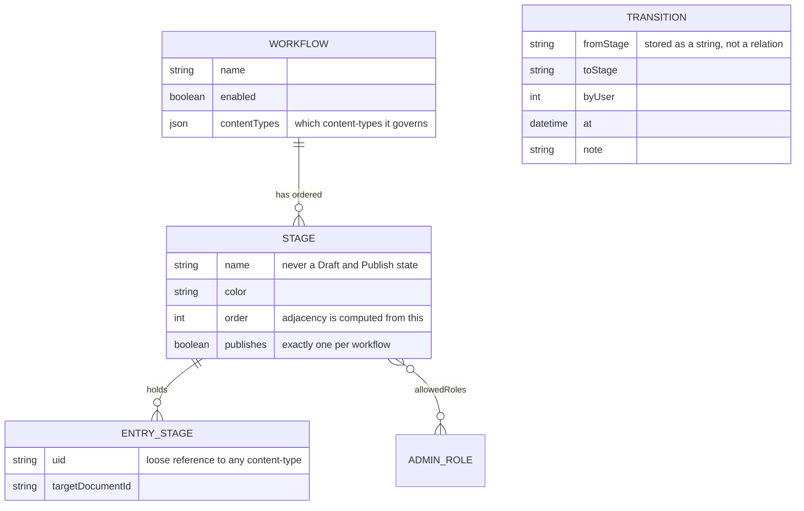
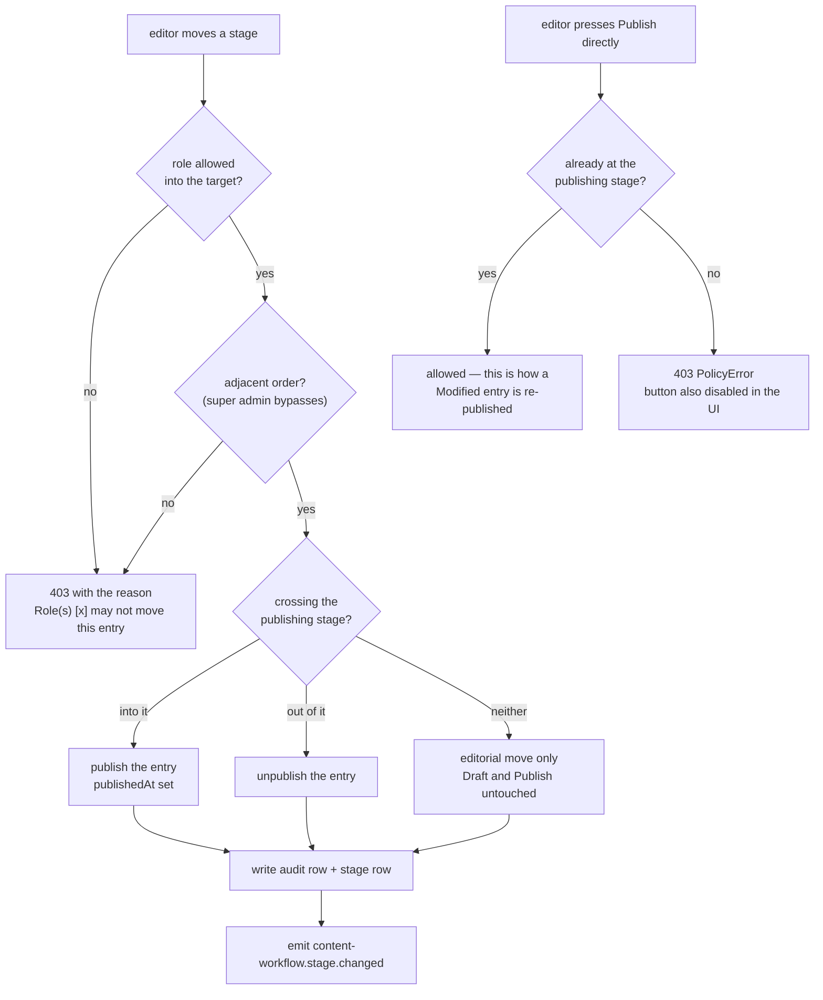
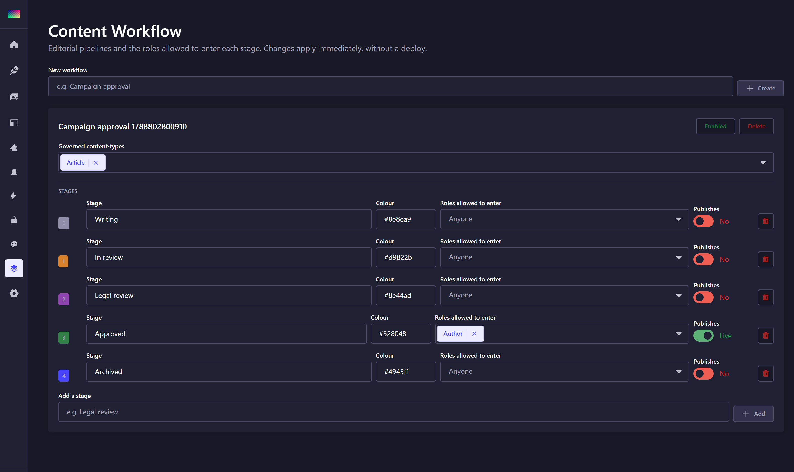
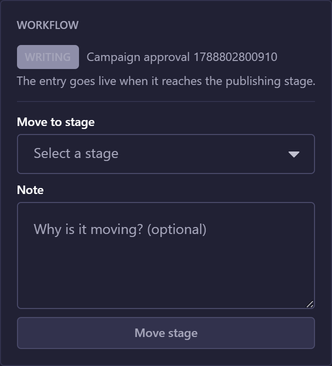

# strapi-plugin-workflow

Editorial **review workflows** for Strapi 5 Community — the Enterprise "Review Workflows"
feature rebuilt as a free plugin: named pipelines, stage-level RBAC, a full audit trail,
and an event other plugins can automate against.

Part of [Strapi Content Hub](../../README.md).

## Install

```bash
pnpm add strapi-plugin-workflow
```

```ts
// config/plugins.ts
export default {
  'content-hub-workflow': {
    enabled: true,
    resolve: 'strapi-plugin-workflow',
  },
};
```

In a pnpm workspace, resolve from the app — see the
[theme plugin README](../strapi-plugin-theme/README.md#install) for the `createRequire`
pattern.

## Model



Two decisions worth knowing:

**The current stage lives in a side table, not in your content-type.** Enabling or
removing a workflow never rewrites another content-type's schema or migrates its data, and
an entry that has never moved sits in the first stage *implicitly* — no row is written
until something actually changes, so turning a workflow on does not backfill every
existing entry.

**Transition names are stored as strings in the audit log.** A record must stay readable
after the stage it refers to is renamed or deleted.

## Stages and Draft & Publish

Strapi already has a published state. A workflow stage is a *different* axis — where the work
has got to editorially — and the two must not be allowed to disagree.

They used to. The seeded pipeline was `Draft → In review → Approved → Published`, and the
stage panel is injected into the same right-hand column as Strapi's own status badge, so two
badges showed the same two words meaning different things. Nothing connected them either, so
both of these were reachable and neither looked like a bug:

- an entry in stage **Published** whose `publishedAt` was `null` — the panel claimed it was
  live while the Content Manager, correctly, called it a draft;
- an entry published straight from stage **Draft** with the Publish button, skipping the whole
  review pipeline.

Three rules now keep the axes in agreement:

1. **No stage may be named after a Draft & Publish state.** `Draft`, `Published` and
   `Modified` are rejected on create and rename. The seeded pipeline is
   `Writing → In review → Approved`.
2. **Exactly one stage carries `publishes`.** Reaching it publishes the entry; leaving it
   takes the entry down. Ticking it on one stage clears it from the others, so the pipeline
   always has a single answer to "is this entry meant to be live?".
3. **Publish and Unpublish are gated.** A document-service middleware refuses a publish that
   would skip the pipeline and an unpublish that would contradict the publishing stage.
   Publishing *at* the publishing stage stays allowed — editing a published entry puts it in
   Strapi's `Modified` state and re-publishing is the only way out.

The gate lives in the document service, so it applies to REST, GraphQL and any script. The
admin additionally disables the buttons with the reason on them, which is courtesy rather than
enforcement — without it the rule still holds, the editor just meets it as a 403 toast.

A content-type with `draftAndPublish: false` has no published state to contradict, so the
bridge does nothing for it and the pipeline is purely editorial.

## The publish gate



The Draft & Publish change is applied **before** the stage row is written, so a refused publish
leaves the entry exactly where it was. The other order would fail in the one way this whole
design exists to prevent: a stage claiming an entry is live when it is not.

Note `PolicyError` rather than `ForbiddenError`. Strapi's authorize middleware catches any
`ForbiddenError` on its way out and replaces it with a bare `ctx.forbidden()` — status 403,
message `"Forbidden"`, no detail. `PolicyError` is the one subclass it explicitly lets through
with a visible message, so the editor is told *which* stage to move to.

## Rules

Enforced server-side by `canTransition` in this plugin's own
[`shared/workflow.ts`](./shared/workflow.ts), so the panel and the API cannot disagree:

1. **Adjacency** — an entry moves one step at a time, forward to progress or backward to
   send work back for revision. Skipping stages is rejected.
2. **Stage gate** — the target stage's `allowedRoles` must include one of the user's admin
   roles. A stage with no roles listed is open to anyone who can edit the entry.
3. **Super admin bypasses rule 1**, but never silently: the move is still audited.

Rejections return **403** with the reason, e.g.

```
Role(s) [strapi-editor] may not move this entry from "Approved" to "In review"
```

The edit-view panel only offers stages that pass both rules, so the UI never dangles an
action that will be rejected — but the server remains the authority.

## Admin UI

### Settings page



Create workflows, bind them to content-types, add, rename and recolour stages, pick the roles
allowed to enter each one, and tick which **single** stage publishes. All of it is data, so an
editorial process changes without a deploy.

Ticking `publishes` on one stage clears it from the others, so the pipeline is never briefly in
a state where two stages both claim to make an entry live — the publish gate would then have no
single answer to "is this entry meant to be published?".

Stage names are validated: `Draft`, `Published` and `Modified` are refused, because those are
Strapi's own Draft & Publish states and the panel sits in the same column as Strapi's badge.

### Edit-view panel



Injected into `editView / right-links`. Shows the current stage, the transitions available to
*you*, what a move will do to the published state, a note field, and the last five history
entries.

It deliberately shows **no status badge of its own** — Strapi's is right beside it. It renders
nothing when no enabled workflow governs the content-type, so it is registered globally rather
than per content-type.

> The history in that screenshot shows *old* stage names. That is not a bug: transition names
> are stored as strings, so the audit trail stays readable after a stage is renamed or deleted.
> Those rows predate a pipeline migration.

## Using it

**1. Create a pipeline.** Menu **Workflow** → name it → bind the content-types it governs. A new
workflow is seeded with `Writing → In review → Approved`, where `Approved` publishes.

**2. Gate the stages.** Give each stage the admin roles allowed to enter it. A stage with no
roles is open to anyone who can edit the entry.

**3. Move entries from the panel.** Only stages that pass both rules are offered, so the UI
never dangles an action the server will reject.

```bash
# or over the API
curl -X PUT "http://localhost:1337/content-hub-workflow/entries/api::article.article/$DOC/stage" \
  -H "Authorization: Bearer $ADMIN_JWT" -H "Content-Type: application/json" \
  -d '{"stage":"<stage documentId>","note":"legal cleared"}'
```

**4. Let the stage publish.** Do not press Publish; reach the publishing stage and the entry goes
live. Publishing per surface is the [channels plugin](../strapi-plugin-channels/README.md)'s
job, and it needs no second approval.

## Automating on stage changes

```ts
strapi
  .plugin('content-hub-workflow')
  .service('events')
  .on(async (payload) => {
    // { uid, documentId, workflowId, fromStage, toStage, byUser, at, note }
    if (payload.toStage === 'Approved') await pushToMarketingAutomation(payload);
  });
```

The same payload is emitted on Strapi's own event hub as
`content-workflow.stage.changed`, so webhooks see it too. The event fires **only after the
move is durable**, so subscribers never react to a rejected transition. A listener that
throws is logged and swallowed — an automation must never roll back an editorial decision
that already happened.

The [flow plugin](../strapi-plugin-flow/README.md) subscribes here, and guards the
lookup with `if (workflow)` so it still runs when this plugin is absent.

## Admin API

| Method | Route                                         | Purpose                        |
| ------ | --------------------------------------------- | ------------------------------ |
| GET    | `/content-hub-workflow/workflows`             | List workflows with stages     |
| POST   | `/content-hub-workflow/workflows`             | Create (seeded with 4 stages)  |
| PUT    | `/content-hub-workflow/workflows/:id`         | Rename, enable, bind types     |
| DELETE | `/content-hub-workflow/workflows/:id`         | Delete                         |
| POST   | `/content-hub-workflow/workflows/:id/stages`  | Add a stage                    |
| PUT    | `/content-hub-workflow/stages/:id`            | Edit a stage                   |
| DELETE | `/content-hub-workflow/stages/:id`            | Remove a stage                 |
| GET    | `/content-hub-workflow/content-types`         | Bindable content-types         |
| GET    | `/content-hub-workflow/roles`                 | Admin roles, for the picker    |
| GET    | `/content-hub-workflow/entries/:uid/:docId`   | Current stage + available ones |
| PUT    | `/content-hub-workflow/entries/:uid/:docId/stage` | Move stage                 |
| GET    | `/content-hub-workflow/entries/:uid/:docId/history` | Audit trail              |

There are **no public routes**: editorial state is internal to the newsroom, and exposing
stages publicly would leak unreleased content planning. Other plugins read stages through
the service layer.

## Scripts

| Script         | Description                                   |
| -------------- | --------------------------------------------- |
| `pnpm build`   | `strapi-plugin build` — admin + server bundles |
| `pnpm dev`     | `strapi-plugin watch`                          |
| `pnpm verify`  | Publish-readiness check                        |
| `pnpm lint`    | Type-check both halves                         |
| `pnpm test`    | 20 tests over the publish bridge (pure logic)  |

## License

MIT © Suryo Galih Kencana Harianja
